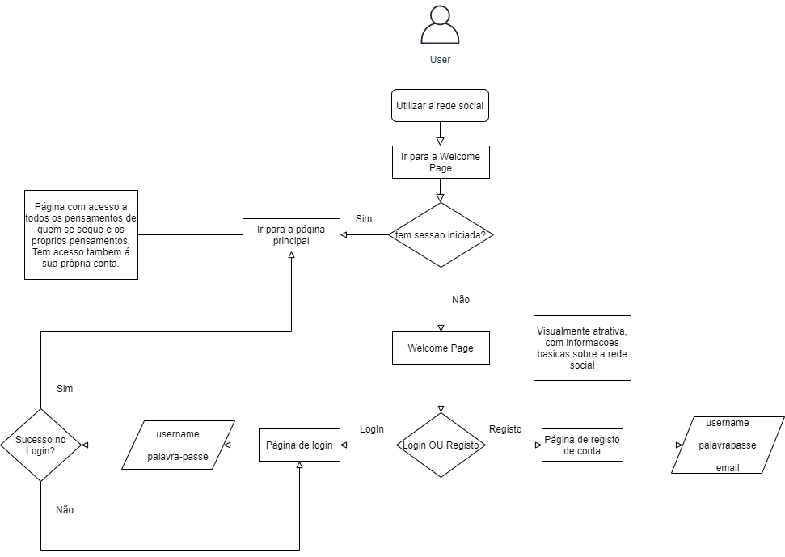
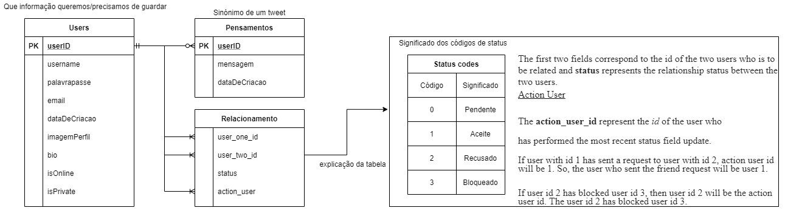

## Thought Sharer (Paródia do Twitter)

Ás vezes não se sente stressado e apetece-lhe falar com alguém mas não tem amigos? Ou talvez queira parecer mais relevante do que realmente é.  
O **Thought Sharer** é perfeito para si então.  
No **Thought Sharer** pode seguir pessoas que não lhe interessam, e pessoas que não lhe interessam podem vos seguir de volta! 
Assim conseguem partilhar todos os pensamentos que não exprimiria na vida real, tal como:  
1. Tou com fome, estava mesmo a apetecer uma lasanha.
2. Não me apetece trabalhar agora, vou procrastinar.
3. Estar nas redes sociais consome muito do meu tempo, o que devo de fazer para solucionar o meu problema?? :(

## Visão geral da aplicação

O Thought Sharer é um site onde o utilizador poderá partilhar os seus pensamentos com outras pessoas, e visualizar pensamentos e perfis de pessoas que o utilizador segue.

## Requisitos da aplicação

O Thought Sharer é um site onde um utilizador poderá criar uma conta e autenticar-se. 
O utilizador poderá partilhar os seus pensamentos com pessoas que o seguem. 
Poderá costumizar a sua conta com uma foto de perfil, uma foto para a sua capa do perfil, o seu nome e uma breve bio do utlizador. 
O utilizador poderá definir a privacidade da sua conta, que definirá quem pode visualizar os seus pensamentos ou não. 

## Arquitetura da aplicação

### FlowChart de funcionalidades da aplicação

### Camada de apresentação

### Camada de acesso a dados

#### Modelo de Dados

## Conclusão

### Tecnologias utilizadas

Editor de texto:  
Visual Studio Code    
TechStack:  
HTML/CSS/JS  
NodeJS (express app)  

Flowchart/DB UML:  
draw.io 
